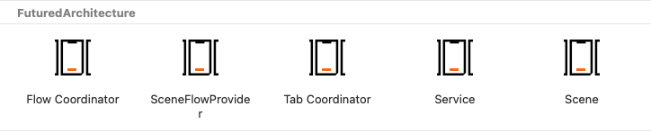

# FuturedKit

SwiftUI app architecture and views used by Futured.

## Documentation

This repository contains two main targets: `FuturedArchitecture` and `FuturedHelpers`. The repository
also contains set of Templates, see `Installation`.

### FuturedArchitecture

This target contains types and protocols supporting the architecture. See 
[Architecture documentation](Sources/FuturedArchitecture/Documentation.docc/Documentation.md).

The repository uses [DocC](https://www.swift.org/documentation/docc/) for developer-friendly access to documentation.

More high-level documentation can be found in the Futured Engineering Handbook [here](https://futuredapp.github.io/Engineering-Handbook/teams/ios/ios_architecture/).

### FuturedHelpers

This target contains non-mandatory extension to the Architecture and additional types and Views which
are commonly used.

- ``TextStyle`` (See source documentation)
- ``CameraImagePicker`` (See source documentation)
- ``GalleryImagePicker`` (See source documentation)

## Installation

When using Swift package manager install using or add following line to your dependencies:

```swift
.package(url: "https://github.com/futuredapp/FuturedKit.git", from: "1.0.0")
```

The repository provides number of Xcode Templates for user convenience.



You can install them using make:

```bash
git clone --depth=1 https://github.com/futuredapp/iOS-templates.git
cd Templates
make
```

## Contributions

All contributions are welcome.

Current maintainer and main contributor is [Ievgen Samoilyk](https://github.com/samoilyk), <ievgen.samoilyk@futured.app>.

## License

FuturedKit is available under the MIT license. See the [LICENSE file](LICENSE) for more information.
